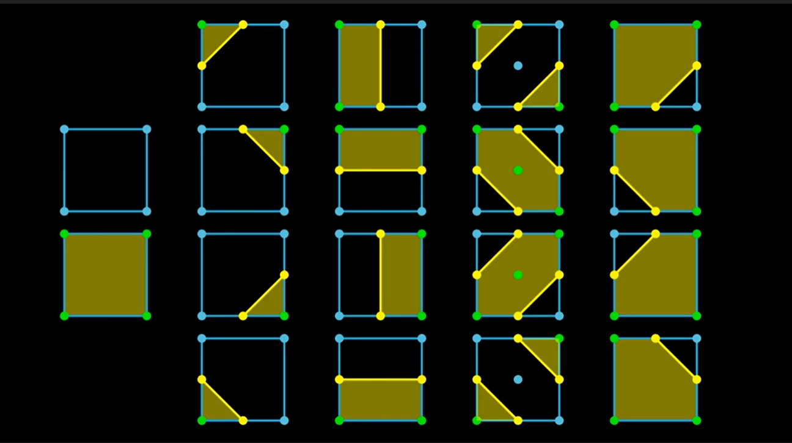

# marching-squares
this repo is an implementation of the marching-squares algorithm to render metaballs on the screen.

idea from a youtube video by Reducible: https://www.youtube.com/watch?v=6oMZb3yP_H8

desmos graph if u just wanna see the math stuff: https://www.desmos.com/calculator/q08htskxrs

# notes:
- metaballs look cool
- many functions can be written implicitly (eg. x^2 + y^2 = 4 encodes a circle)
	- explicit fns: y=f(x)
	- implicit fns: f(x, y)=C, where C is constant
- metaballs is just an implicit fn - kinda like superposition of Magnetic Fields in physics
	- sum( R / sqrt( (x-x1)2 + (y-y1)2 ) ) = C, for all x, y in grid
- marching squares is just an algorithm to draw implicit fns
	- check every grid square, are their corners `< C` or `> C` ?
	- draw a connecting line according to which corners `< C` or `> C`

# todo
- make the balls move more naturally
- add interactivity? (add / remove balls)
- slider for resolution (high res = laggier)
- color in balls